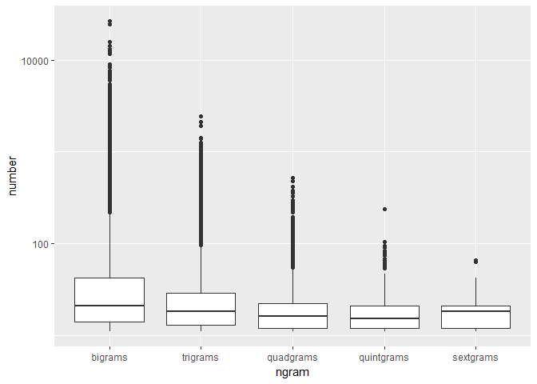
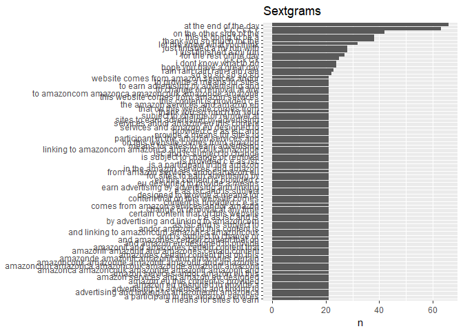
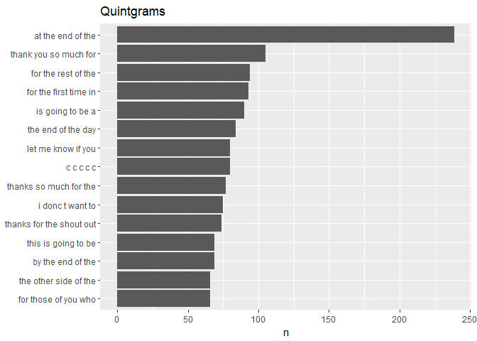
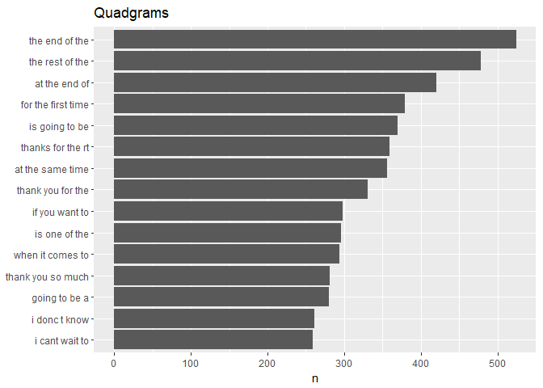
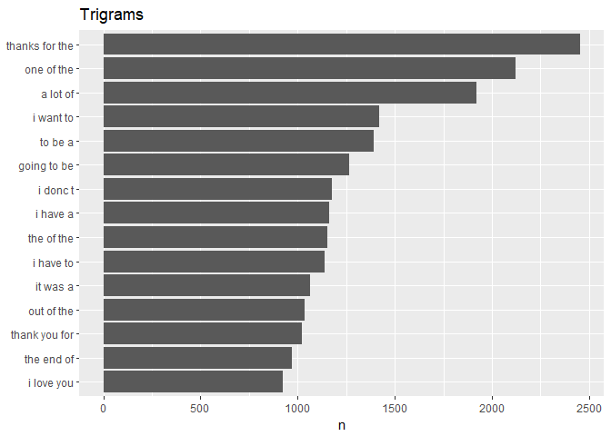
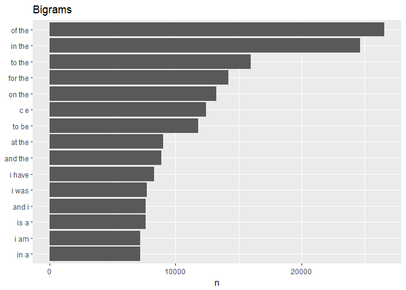

Task 04A: Fast Ngram Files
================
Vishal Balapure
2018-06-15

-   [Load the Data](#load-the-data)
-   [Sample the data](#sample-the-data)
-   [Clean the sample data](#clean-the-sample-data)
-   [Create all n-grams](#create-all-n-grams)
-   [Reduce n-grams files](#reduce-n-grams-files)
-   [What does the distribution on ngrams look like?](#what-does-the-distribution-on-ngrams-look-like)
-   [Separate words](#separate-words)
-   [Session info](#session-info)

    ## Warning: package 'tidytext' was built under R version 3.4.4

    ## Warning: package 'tidyverse' was built under R version 3.4.4

    ## Warning: package 'ggplot2' was built under R version 3.4.3

    ## Warning: package 'tibble' was built under R version 3.4.3

    ## Warning: package 'tidyr' was built under R version 3.4.4

    ## Warning: package 'readr' was built under R version 3.4.4

    ## Warning: package 'purrr' was built under R version 3.4.4

    ## Warning: package 'dplyr' was built under R version 3.4.3

    ## Warning: package 'stringr' was built under R version 3.4.3

    ## Warning: package 'forcats' was built under R version 3.4.4

Load the Data
-------------

English Repository Files

``` r
blogs_file   <- "./data/en_US/en_US.blogs.txt"
news_file    <- "./data/en_US/en_US.news.txt"
twitter_file <- "./data/en_US/en_US.twitter.txt"  
```

Read the data files

``` r
blogs   <- readLines(blogs_file, skipNul = TRUE)
news    <- readLines(news_file,  skipNul = TRUE)
```

    ## Warning in readLines(news_file, skipNul = TRUE): incomplete final line
    ## found on './data/en_US/en_US.news.txt'

``` r
twitter <- readLines(twitter_file, skipNul = TRUE)
```

Create dataframes

``` r
blogs   <- data_frame(text = blogs)
news    <- data_frame(text = news)
twitter <- data_frame(text = twitter)
```

Sample the data
---------------

``` r
set.seed(1001)
sample_pct <- 0.10

blogs_sample <- blogs %>%
        sample_n(., nrow(blogs)*sample_pct)
news_sample <- news %>%
        sample_n(., nrow(news)*sample_pct)
twitter_sample <- twitter %>%
        sample_n(., nrow(twitter)*sample_pct)
```

Create tidy repository

``` r
repo_sample <- bind_rows(mutate(blogs_sample, source = "blogs"),
                         mutate(news_sample,  source = "news"),
                         mutate(twitter_sample, source = "twitter")) 
repo_sample$source <- as.factor(repo_sample$source)
```

Clean up

``` r
rm(list = c("blogs", "blogs_file", "blogs_sample","news", "news_file",     
            "news_sample", "sample_pct", "twitter","twitter_file", 
            "twitter_sample"))
```

Clean the sample data
---------------------

Create filters: non-alphanumeric's, url's, repeated letters(+3x)

``` r
replace_reg <- "[^[:alpha:][:space:]]*"
replace_url <- "http[^[:space:]]*"
replace_aaa <- "\\b(?=\\w*(\\w)\\1)\\w+\\b"  
```

Clean the sample. Cleaning is separted from tidying so `unnest_tokens` function can be used for words, and ngrams.

``` r
clean_sample <-  repo_sample %>%
        mutate(text = str_replace_all(text, replace_reg, "")) %>%
        mutate(text = str_replace_all(text, replace_url, "")) %>%
        mutate(text = str_replace_all(text, replace_aaa, "")) %>% 
        mutate(text = iconv(text, "ASCII//TRANSLIT"))
```

    ## Warning: package 'bindrcpp' was built under R version 3.4.4

``` r
rm(list = c("repo_sample"))
```

Create all n-grams
------------------

Bigrams

``` r
bigram_repo <- clean_sample  %>%
        unnest_tokens(bigram, text, token = "ngrams", n = 2)
```

Trigrams

``` r
trigram_repo <- clean_sample  %>%
        unnest_tokens(trigram, text, token = "ngrams", n = 3)
```

Quadgrams

``` r
quadgram_repo <- clean_sample  %>%
        unnest_tokens(quadgram, text, token = "ngrams", n = 4)
```

Quintgrams

``` r
quintgram_repo <- clean_sample  %>%
        unnest_tokens(quintgram, text, token = "ngrams", n = 5)
```

Sextgrams

``` r
sextgram_repo <- clean_sample  %>%
        unnest_tokens(sextgram, text, token = "ngrams", n = 6)
```

Reduce n-grams files
--------------------

Bigrams

``` r
bigram_cover <- bigram_repo %>%
        count(bigram) %>%  
        filter(n > 10) %>%
        arrange(desc(n))  
rm(list = c("bigram_repo"))
```

Trigrams

``` r
trigram_cover <- trigram_repo %>%
        count(trigram) %>%  
        filter(n > 10) %>%
        arrange(desc(n))  
rm(list = c("trigram_repo"))
```

Quadgrams

``` r
quadgram_cover <- quadgram_repo %>%
        count(quadgram) %>%  
        filter(n > 10) %>%
        arrange(desc(n))  
rm(list = c("quadgram_repo"))
```

Quintgrams

``` r
quintgram_cover <- quintgram_repo %>%
        count(quintgram) %>%  
        filter(n > 10) %>%
        arrange(desc(n))  
rm(list = c("quintgram_repo"))
```

Sextgrams

``` r
sextgram_cover <- sextgram_repo %>%
        count(sextgram) %>%  
        filter(n > 10) %>%
        arrange(desc(n))  
rm(list = c("sextgram_repo"))
```

What does the distribution on ngrams look like?
-----------------------------------------------

``` r
disty <- data_frame(ngram = c(rep("bigrams",  nrow(bigram_cover)),
                              rep("trigrams",  nrow(trigram_cover)),
                              rep("quadgrams", nrow(quadgram_cover)),
                              rep("quintgrams", nrow(quintgram_cover)),
                              rep("sextgrams",  nrow(sextgram_cover))),
                    number = c(bigram_cover$n,  trigram_cover$n, 
                               quadgram_cover$n, quintgram_cover$n,
                               sextgram_cover$n))
disty
```

    ## # A tibble: 101,631 x 2
    ##    ngram   number
    ##    <chr>    <int>
    ##  1 bigrams  26610
    ##  2 bigrams  24653
    ##  3 bigrams  15989
    ##  4 bigrams  14186
    ##  5 bigrams  13226
    ##  6 bigrams  12410
    ##  7 bigrams  11822
    ##  8 bigrams   8997
    ##  9 bigrams   8864
    ## 10 bigrams   8292
    ## # ... with 101,621 more rows

``` r
disty$ngram <- as.factor(disty$ngram)
ggplot(data = disty, aes(y = number, x = reorder(ngram, -number))) +
        geom_boxplot() + scale_y_log10() +
        xlab("ngram")
```



``` r
ggsave("./ngram_match/www/ngrams.png")
```

    ## Saving 7 x 5 in image

``` r
sextgram_cover %>%
        top_n(15, n) %>%
        mutate(sextgram = reorder(sextgram, n)) %>%
        ggplot(aes(sextgram, n)) +
        geom_col() +
        xlab(NULL) +
        coord_flip() +
        ggtitle("Sextgrams")
```



``` r
ggsave("./ngram_match/www/sextgrams.png")
```

    ## Saving 7 x 5 in image

``` r
quintgram_cover %>%
        top_n(15, n) %>%
        mutate(quintgram = reorder(quintgram, n)) %>%
        ggplot(aes(quintgram, n)) +
        geom_col() +
        xlab(NULL) +
        coord_flip() +
        ggtitle("Quintgrams")
```



``` r
ggsave("./ngram_match/www/quintgrams.png")
```

    ## Saving 7 x 5 in image

``` r
quadgram_cover %>%
        top_n(15, n) %>%
        mutate(quadgram = reorder(quadgram, n)) %>%
        ggplot(aes(quadgram, n)) +
        geom_col() +
        xlab(NULL) +
        coord_flip() +
        ggtitle("Quadgrams")
```



``` r
ggsave("./ngram_match/www/quadgrams.png")
```

    ## Saving 7 x 5 in image

``` r
trigram_cover %>%
        top_n(15, n) %>%
        mutate(trigram = reorder(trigram, n)) %>%
        ggplot(aes(trigram, n)) +
        geom_col() +
        xlab(NULL) +
        coord_flip() +
        ggtitle("Trigrams")
```



``` r
ggsave("./ngram_match/www/trigrams.png")
```

    ## Saving 7 x 5 in image

``` r
bigram_cover %>%
        top_n(15, n) %>%
        mutate(bigram = reorder(bigram, n)) %>%
        ggplot(aes(bigram, n)) +
        geom_col() +
        xlab(NULL) +
        coord_flip() +
        ggtitle("Bigrams")
```



``` r
ggsave("./ngram_match/www/bigrams.png")
```

    ## Saving 7 x 5 in image

Separate words
--------------

``` r
bi_words <- bigram_cover %>%
        separate(bigram, c("word1", "word2"), sep = " ")
bi_words
```

    ## # A tibble: 59,760 x 3
    ##    word1 word2     n
    ##    <chr> <chr> <int>
    ##  1 of    the   26610
    ##  2 in    the   24653
    ##  3 to    the   15989
    ##  4 for   the   14186
    ##  5 on    the   13226
    ##  6 c     e     12410
    ##  7 to    be    11822
    ##  8 at    the    8997
    ##  9 and   the    8864
    ## 10 i     have   8292
    ## # ... with 59,750 more rows

``` r
tri_words <- trigram_cover %>%
        separate(trigram, c("word1", "word2", "word3"), sep = " ")
tri_words
```

    ## # A tibble: 34,474 x 4
    ##    word1  word2 word3     n
    ##    <chr>  <chr> <chr> <int>
    ##  1 thanks for   the    2454
    ##  2 one    of    the    2120
    ##  3 a      lot   of     1919
    ##  4 i      want  to     1420
    ##  5 to     be    a      1394
    ##  6 going  to    be     1264
    ##  7 i      donc  t      1178
    ##  8 i      have  a      1164
    ##  9 the    of    the    1151
    ## 10 i      have  to     1137
    ## # ... with 34,464 more rows

``` r
quad_words <- quadgram_cover %>%
        separate(quadgram, c("word1", "word2", "word3", "word4"), sep = " ")
quad_words
```

    ## # A tibble: 6,401 x 5
    ##    word1  word2 word3 word4     n
    ##    <chr>  <chr> <chr> <chr> <int>
    ##  1 the    end   of    the     525
    ##  2 the    rest  of    the     478
    ##  3 at     the   end   of      420
    ##  4 for    the   first time    379
    ##  5 is     going to    be      370
    ##  6 thanks for   the   rt      359
    ##  7 at     the   same  time    356
    ##  8 thank  you   for   the     331
    ##  9 if     you   want  to      298
    ## 10 is     one   of    the     296
    ## # ... with 6,391 more rows

``` r
quint_words <- quintgram_cover %>%
        separate(quintgram, c("word1", "word2", "word3", "word4", "word5"), sep = " ")
quint_words
```

    ## # A tibble: 837 x 6
    ##    word1  word2 word3 word4 word5     n
    ##    <chr>  <chr> <chr> <chr> <chr> <int>
    ##  1 at     the   end   of    the     239
    ##  2 thank  you   so    much  for     105
    ##  3 for    the   rest  of    the      94
    ##  4 for    the   first time  in       93
    ##  5 is     going to    be    a        90
    ##  6 the    end   of    the   day      84
    ##  7 c      c     c     c     c        80
    ##  8 let    me    know  if    you      80
    ##  9 thanks so    much  for   the      77
    ## 10 i      donc  t     want  to       75
    ## # ... with 827 more rows

``` r
sext_words <- sextgram_cover %>%
        separate(sextgram, c("word1", "word2", "word3", "word4", "word5", "word6"), sep = " ")
sext_words
```

    ## # A tibble: 159 x 7
    ##    word1 word2    word3    word4 word5 word6     n
    ##    <chr> <chr>    <chr>    <chr> <chr> <chr> <int>
    ##  1 at    the      end      of    the   day      66
    ##  2 c     c        c        c     c     c        63
    ##  3 on    the      other    side  of    the      42
    ##  4 thank you      so       much  for   the      38
    ##  5 this  is       going    to    be    a        38
    ##  6 let   me       know     what  you   think    32
    ##  7 i     just     finished a     mi    run      28
    ##  8 just  finished a        mi    run   with     28
    ##  9 for   the      rest     of    the   day      27
    ## 10 c     k        c        k     c     k        25
    ## # ... with 149 more rows

Save data for the Shiny App

``` r
saveRDS(bi_words, "./ngram_match/app_data/bi_words_fast.rds")
saveRDS(tri_words, "./ngram_match/app_data/tri_words_fast.rds")
saveRDS(quad_words,"./ngram_match/app_data/quad_words_fast.rds")
saveRDS(quint_words,"./ngram_match/app_data/quint_words_fast.rds")
saveRDS(sext_words,"./ngram_match/app_data/sext_words_fast.rds")
```

------------------------------------------------------------------------

Session info
------------

``` r
sessionInfo()
```

    ## R version 3.4.2 (2017-09-28)
    ## Platform: x86_64-w64-mingw32/x64 (64-bit)
    ## Running under: Windows 10 x64 (build 15063)
    ## 
    ## Matrix products: default
    ## 
    ## locale:
    ## [1] LC_COLLATE=English_United States.1252 
    ## [2] LC_CTYPE=English_United States.1252   
    ## [3] LC_MONETARY=English_United States.1252
    ## [4] LC_NUMERIC=C                          
    ## [5] LC_TIME=English_United States.1252    
    ## 
    ## attached base packages:
    ## [1] stats     graphics  grDevices utils     datasets  methods   base     
    ## 
    ## other attached packages:
    ##  [1] bindrcpp_0.2.2  knitr_1.20      forcats_0.3.0   stringr_1.3.0  
    ##  [5] dplyr_0.7.4     purrr_0.2.4     readr_1.1.1     tidyr_0.8.0    
    ##  [9] tibble_1.4.2    ggplot2_2.2.1   tidyverse_1.2.1 tidytext_0.1.9 
    ## 
    ## loaded via a namespace (and not attached):
    ##  [1] tidyselect_0.2.4  reshape2_1.4.3    haven_1.1.1      
    ##  [4] lattice_0.20-35   colorspace_1.3-2  htmltools_0.3.6  
    ##  [7] SnowballC_0.5.1   yaml_2.1.19       utf8_1.1.3       
    ## [10] rlang_0.2.0       pillar_1.2.2      foreign_0.8-69   
    ## [13] glue_1.2.0        modelr_0.1.2      readxl_1.1.0     
    ## [16] bindr_0.1.1       plyr_1.8.4        munsell_0.4.3    
    ## [19] gtable_0.2.0      cellranger_1.1.0  rvest_0.3.2      
    ## [22] psych_1.8.4       evaluate_0.10.1   labeling_0.3     
    ## [25] parallel_3.4.2    broom_0.4.4       tokenizers_0.2.1 
    ## [28] Rcpp_0.12.16      backports_1.1.2   scales_0.5.0     
    ## [31] jsonlite_1.5      mnormt_1.5-5      hms_0.4.2        
    ## [34] digest_0.6.15     stringi_1.1.7     grid_3.4.2       
    ## [37] rprojroot_1.3-2   cli_1.0.0         tools_3.4.2      
    ## [40] magrittr_1.5      lazyeval_0.2.1    janeaustenr_0.1.5
    ## [43] crayon_1.3.4      pkgconfig_2.0.1   Matrix_1.2-11    
    ## [46] xml2_1.2.0        lubridate_1.7.4   assertthat_0.2.0 
    ## [49] rmarkdown_1.9     httr_1.3.1        rstudioapi_0.7   
    ## [52] R6_2.2.2          nlme_3.1-131      compiler_3.4.2
