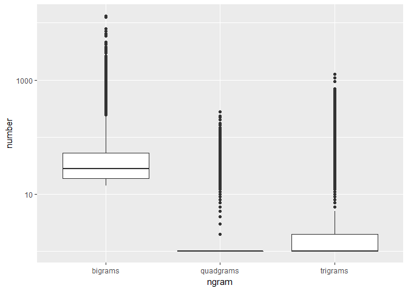

Task 04: Working toward a Prediction Model
================
Vishal Balapure
2018-06-15

-   [Load the Data](#load-the-data)
-   [Sample the data](#sample-the-data)
-   [Clean the data](#clean-the-data)
-   [Create all n-grams](#create-all-n-grams)
-   [Reduce n-grams to top 50% of CDF](#reduce-n-grams-to-top-50-of-cdf)
-   [Separate words](#separate-words)
-   [Clear workspace, time load](#clear-workspace-time-load)
-   [What does the distribution of ngrams look like?](#what-does-the-distribution-of-ngrams-look-like)
-   [Session info](#session-info)

This script creates the ngram files used to predict ngrams based on user input. These files are used by prediction functions found in `05_Task_Script.R`

    ## Warning: package 'tidytext' was built under R version 3.4.4

    ## Warning: package 'tidyverse' was built under R version 3.4.4

    ## Warning: package 'ggplot2' was built under R version 3.4.3

    ## Warning: package 'tibble' was built under R version 3.4.3

    ## Warning: package 'tidyr' was built under R version 3.4.4

    ## Warning: package 'readr' was built under R version 3.4.4

    ## Warning: package 'purrr' was built under R version 3.4.4

    ## Warning: package 'dplyr' was built under R version 3.4.3

    ## Warning: package 'stringr' was built under R version 3.4.3

    ## Warning: package 'forcats' was built under R version 3.4.4

    ## Warning: package 'wordcloud' was built under R version 3.4.4

Load the Data
-------------

English Repository Files

``` r
blogs_file   <- "./data/en_US/en_US.blogs.txt"
news_file    <- "./data/en_US/en_US.news.txt"
twitter_file <- "./data/en_US/en_US.twitter.txt"  
```

Read the data files

``` r
blogs   <- readLines(blogs_file, skipNul = TRUE)
news    <- readLines(news_file,  skipNul = TRUE)
```

    ## Warning in readLines(news_file, skipNul = TRUE): incomplete final line
    ## found on './data/en_US/en_US.news.txt'

``` r
twitter <- readLines(twitter_file, skipNul = TRUE)
```

Read the data files into dataframes

``` r
blogs   <- data_frame(text = blogs)
news    <- data_frame(text = news)
twitter <- data_frame(text = twitter)
```

Sample the data
---------------

``` r
set.seed(1001)
sample_pct <- 0.05

blogs_sample <- blogs %>%
        sample_n(., nrow(blogs)*sample_pct)
news_sample <- news %>%
        sample_n(., nrow(news)*sample_pct)
twitter_sample <- twitter %>%
        sample_n(., nrow(twitter)*sample_pct)
```

Create tidy repository

``` r
repo_sample <- bind_rows(mutate(blogs_sample, source = "blogs"),
                         mutate(news_sample,  source = "news"),
                         mutate(twitter_sample, source = "twitter")) 
repo_sample$source <- as.factor(repo_sample$source)
```

Clean the data
--------------

Create filters: non-alphanumeric's, url's, repeated letters(+3x)

``` r
replace_reg <- "[^[:alpha:][:space:]]*"
replace_url <- "http[^[:space:]]*"
replace_aaa <- "\\b(?=\\w*(\\w)\\1)\\w+\\b"  
```

Clean the sample. Cleaning is separted from tidying so `unnest_tokens` function can be used for words, and ngrams.

``` r
clean_sample <-  repo_sample %>%
        mutate(text = str_replace_all(text, replace_reg, "")) %>%
        mutate(text = str_replace_all(text, replace_url, "")) %>%
        mutate(text = str_replace_all(text, replace_aaa, "")) %>% 
        mutate(text = iconv(text, "ASCII//TRANSLIT"))
```

    ## Warning: package 'bindrcpp' was built under R version 3.4.4

Create all n-grams
------------------

Unigrams

``` r
tidy_repo <- clean_sample %>%
        unnest_tokens(word, text) 
```

Bigrams

``` r
bigram_repo <- clean_sample  %>%
        unnest_tokens(bigram, text, token = "ngrams", n = 2)
```

Trigrams

``` r
trigram_repo <- clean_sample  %>%
        unnest_tokens(trigram, text, token = "ngrams", n = 3)
```

Quadgrams

``` r
quadgram_repo <- clean_sample  %>%
        unnest_tokens(quadgram, text, token = "ngrams", n = 4)
```

Reduce n-grams to top 50% of CDF
--------------------------------

Unigram upper half

``` r
cover_50 <- tidy_repo %>%
        count(word) %>%  
        mutate(proportion = n / sum(n)) %>%
        arrange(desc(proportion)) %>%  
        mutate(coverage = cumsum(proportion)) %>%
        filter(coverage <= 0.5)
```

Bigram upper half

``` r
bigram_cover_50 <- bigram_repo %>%
        count(bigram) %>%  
        mutate(proportion = n / sum(n)) %>%
        arrange(desc(proportion)) %>%  
        mutate(coverage = cumsum(proportion)) %>%
        filter(coverage <= 0.5)
```

Trigram upper half

``` r
trigram_cover_50 <- trigram_repo %>%
        count(trigram) %>%  
        mutate(proportion = n / sum(n)) %>%
        arrange(desc(proportion)) %>%  
        mutate(coverage = cumsum(proportion)) %>%
        filter(coverage <= 0.5)
```

Quadgram upper half

``` r
quadgram_cover_50 <- quadgram_repo %>%
        count(quadgram) %>%  
        mutate(proportion = n / sum(n)) %>%
        arrange(desc(proportion)) %>%  
        mutate(coverage = cumsum(proportion)) %>%
        filter(coverage <= 0.5)
```

Separate words
--------------

``` r
bi_words <- bigram_cover_50 %>%
        separate(bigram, c("word1", "word2"), sep = " ")
bi_words
```

    ## # A tibble: 22,481 x 5
    ##    word1 word2     n proportion coverage
    ##    <chr> <chr> <int>      <dbl>    <dbl>
    ##  1 of    the   13151    0.00424  0.00424
    ##  2 in    the   12482    0.00402  0.00826
    ##  3 to    the    7892    0.00254  0.0108 
    ##  4 for   the    7178    0.00231  0.0131 
    ##  5 on    the    6450    0.00208  0.0152 
    ##  6 c     e      6280    0.00202  0.0172 
    ##  7 to    be     5935    0.00191  0.0191 
    ##  8 at    the    4627    0.00149  0.0206 
    ##  9 and   the    4520    0.00146  0.0221 
    ## 10 i     have   4226    0.00136  0.0234 
    ## # ... with 22,471 more rows

``` r
tri_words <- trigram_cover_50 %>%
        separate(trigram, c("word1", "word2", "word3"), sep = " ")
tri_words
```

    ## # A tibble: 739,688 x 6
    ##    word1  word2 word3     n proportion coverage
    ##    <chr>  <chr> <chr> <int>      <dbl>    <dbl>
    ##  1 thanks for   the    1268   0.000409 0.000409
    ##  2 one    of    the    1080   0.000348 0.000757
    ##  3 a      lot   of      938   0.000302 0.00106 
    ##  4 i      want  to      700   0.000226 0.00128 
    ##  5 to     be    a       659   0.000212 0.00150 
    ##  6 going  to    be      615   0.000198 0.00170 
    ##  7 i      donc  t       611   0.000197 0.00189 
    ##  8 i      have  to      601   0.000194 0.00209 
    ##  9 i      have  a       592   0.000191 0.00228 
    ## 10 the    of    the     560   0.000181 0.00246 
    ## # ... with 739,678 more rows

``` r
quad_words <- quadgram_cover_50 %>%
        separate(quadgram, c("word1", "word2", "word3", "word4"), sep = " ")
quad_words
```

    ## # A tibble: 1,364,574 x 7
    ##    word1  word2 word3 word4     n proportion  coverage
    ##    <chr>  <chr> <chr> <chr> <int>      <dbl>     <dbl>
    ##  1 the    end   of    the     274  0.0000883 0.0000883
    ##  2 the    rest  of    the     232  0.0000748 0.000163 
    ##  3 at     the   end   of      225  0.0000725 0.000236 
    ##  4 thanks for   the   rt      201  0.0000648 0.000300 
    ##  5 is     going to    be      172  0.0000554 0.000356 
    ##  6 thank  you   for   the     164  0.0000529 0.000409 
    ##  7 for    the   first time    163  0.0000525 0.000461 
    ##  8 at     the   same  time    161  0.0000519 0.000513 
    ##  9 thank  you   so    much    148  0.0000477 0.000561 
    ## 10 is     one   of    the     146  0.0000471 0.000608 
    ## # ... with 1,364,564 more rows

Save separated words for prediction

``` r
saveRDS(bi_words, "./clean_repos/bi_words.rds")
saveRDS(tri_words, "./clean_repos/tri_words.rds")
saveRDS(quad_words, "./clean_repos/quad_words.rds")
```

Clear workspace, time load
--------------------------

``` r
# rm(list= ls())

go <- Sys.time()
library(tidyverse)
library(stringr)
bi_words <- readRDS("./clean_repos/bi_words.rds")
tri_words  <- readRDS("./clean_repos/tri_words.rds")
quad_words <- readRDS("./clean_repos/quad_words.rds")

stop <- Sys.time()
(how_long <- stop - go)
```

    ## Time difference of 10.70402 secs

What does the distribution of ngrams look like?
-----------------------------------------------

Suggests there may be a better way to subset. See `04A_Task_Script.R`

``` r
disty = data_frame(ngram = c(rep("bigrams",   nrow(bigram_cover_50)),
                             rep("trigrams",  nrow(trigram_cover_50)),
                             rep("quadgrams", nrow(quadgram_cover_50))), 
                   number = c(bigram_cover_50$n, trigram_cover_50$n, quadgram_cover_50$n))

disty$ngram <- as.factor(disty$ngram)
ggplot(data = disty, aes(y = number, x = ngram)) + geom_boxplot() + scale_y_log10()
```



------------------------------------------------------------------------

Session info
------------

``` r
sessionInfo()
```

    ## R version 3.4.2 (2017-09-28)
    ## Platform: x86_64-w64-mingw32/x64 (64-bit)
    ## Running under: Windows 10 x64 (build 15063)
    ## 
    ## Matrix products: default
    ## 
    ## locale:
    ## [1] LC_COLLATE=English_United States.1252 
    ## [2] LC_CTYPE=English_United States.1252   
    ## [3] LC_MONETARY=English_United States.1252
    ## [4] LC_NUMERIC=C                          
    ## [5] LC_TIME=English_United States.1252    
    ## 
    ## attached base packages:
    ## [1] stats     graphics  grDevices utils     datasets  methods   base     
    ## 
    ## other attached packages:
    ##  [1] bindrcpp_0.2.2     ngram_3.0.4        wordcloud_2.5     
    ##  [4] RColorBrewer_1.1-2 knitr_1.20         forcats_0.3.0     
    ##  [7] stringr_1.3.0      dplyr_0.7.4        purrr_0.2.4       
    ## [10] readr_1.1.1        tidyr_0.8.0        tibble_1.4.2      
    ## [13] ggplot2_2.2.1      tidyverse_1.2.1    tidytext_0.1.9    
    ## 
    ## loaded via a namespace (and not attached):
    ##  [1] tidyselect_0.2.4  slam_0.1-43       reshape2_1.4.3   
    ##  [4] haven_1.1.1       lattice_0.20-35   colorspace_1.3-2 
    ##  [7] htmltools_0.3.6   SnowballC_0.5.1   yaml_2.1.19      
    ## [10] utf8_1.1.3        rlang_0.2.0       pillar_1.2.2     
    ## [13] foreign_0.8-69    glue_1.2.0        modelr_0.1.2     
    ## [16] readxl_1.1.0      bindr_0.1.1       plyr_1.8.4       
    ## [19] munsell_0.4.3     gtable_0.2.0      cellranger_1.1.0 
    ## [22] rvest_0.3.2       psych_1.8.4       evaluate_0.10.1  
    ## [25] parallel_3.4.2    broom_0.4.4       tokenizers_0.2.1 
    ## [28] Rcpp_0.12.16      backports_1.1.2   scales_0.5.0     
    ## [31] jsonlite_1.5      mnormt_1.5-5      hms_0.4.2        
    ## [34] digest_0.6.15     stringi_1.1.7     grid_3.4.2       
    ## [37] rprojroot_1.3-2   cli_1.0.0         tools_3.4.2      
    ## [40] magrittr_1.5      lazyeval_0.2.1    janeaustenr_0.1.5
    ## [43] crayon_1.3.4      pkgconfig_2.0.1   Matrix_1.2-11    
    ## [46] xml2_1.2.0        lubridate_1.7.4   assertthat_0.2.0 
    ## [49] rmarkdown_1.9     httr_1.3.1        rstudioapi_0.7   
    ## [52] R6_2.2.2          nlme_3.1-131      compiler_3.4.2
